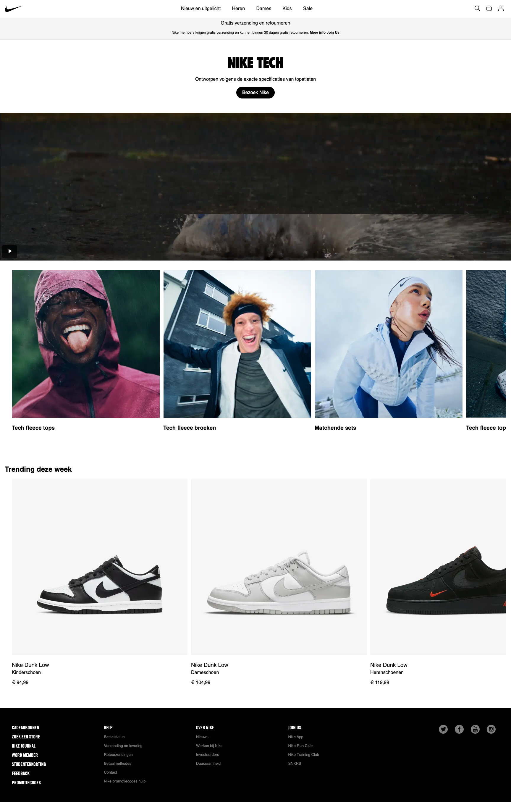
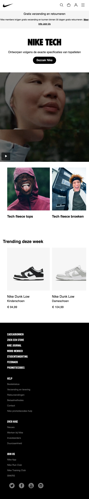
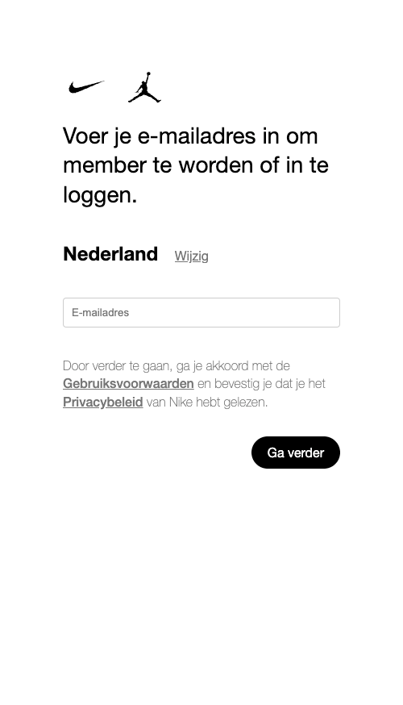
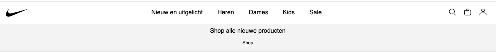
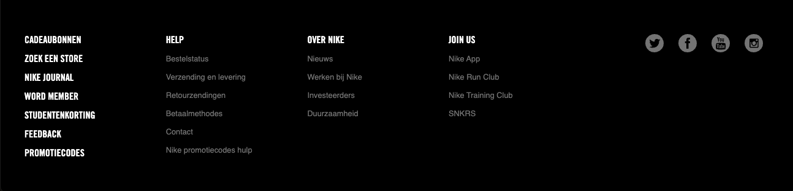

# Procesverslag
Markdown is een simpele manier om HTML te schrijven.  
Markdown cheat cheet: [Hulp bij het schrijven van Markdown](https://github.com/adam-p/markdown-here/wiki/Markdown-Cheatsheet).

Nb. De standaardstructuur en de spartaanse opmaak van de README.md zijn helemaal prima. Het gaat om de inhoud van je procesverslag. Besteedt de tijd voor pracht en praal aan je website.

Nb. Door *open* toe te voegen aan een *details* element kun je deze standaard open zetten. Fijn om dat steeds voor de relevante stuk(ken) te doen.

## Jij

  
uitwerken voor kick-off werkgroep

  ### Auteur:
 Melvin Kramer

  #### Je startniveau: Blauwe piste
 Blauwe piste

  #### Je focus: Responsive
  Responsive
 

## Je website

  
uitwerken voor kick-off werkgroep

  ### Je opdracht: https://www.nike.com/nl/
  link naar de website die je gaat namaken óf de naam/omschrijving van je eigen ontwerp

  #### Screenshot(s) van de eerste pagina (small screen): 
 Nike.com
  

  #### Screenshot(s) van de tweede pagina (small screen):
  Verhalen
  
 

## Toegankelijkheidstest 1/2 (week 1)

  
uitwerken na test in 2e werkgroep

  ### Bevindingen
  Lijst met je bevindingen die in de test naar voren kwamen:

Bij een groot bedrijf als Nike verwacht je een website die tiptop in orde is en voldoet aan de laatste standaard zoals deze voor de WCAG wordt beschreven op hun Website. Niks is minder waar en toch blijkt dat er tientallen punten zijn die beter kunnen. De grootste vraag waar ik mee zit is "waarom"? Waarom is een website die dagelijks bezocht wordt door duizenden - zo niet tienduizenden mensen per dag semantisch niet correct volgens de richtlijnen. Na het vragen aan Sanne (Docent FED) gaf hij aan dat dit te maken heeft met de macht van developers. Hij/zij worden niet van bovenaf gecorrigeerd, waardoor ze eigenlijk vrij spel hebben. Daarom lijkt het mij een super goede opdracht om vanuit het vak de website te herstructureren en tevens toegankelijker maken dan de website die momenteel geschreven is. Door deze opdracht ga ik als ontwerper beter begrijpen wat de voordelen zijn van een correcte website die voldoet aan de richtlijnen van de WCAG.

De website van Nike ziet er goed en gelikt uit. Daar is denk ik iedereen het over eens. Toch blijkt de globale code niet valide en worden er onnodig meerdere div's en classes gebruikt. De navigatie via het toetsenbord door de pagina gaat goed. Dit geldt ook voor het navigeren op mobiel. Vervolgens komen we bij de geschreven code. Het valt op dat er van H1 naar h4 wordt gesprongen en de volgorde dus onlogisch is. Ook worden afbeeldingen niet beschreven als tekst waardoor het begrijpen voor iemand met beperkt zicht onmogelijk wordt gemaakt. Video's op de pagina worden automatisch afgespeeld, zijn niet te pauzeren doch is het niet storend en draagt het bij aan de aankleding van de pagina. Helaas is er geen transcriptie voor de video's. De controle van de pagina is verder in orde los van het pauzeren van de video. Qua toegankelijkheid word de dark/light mode niet ondersteunt. Qua contrast is alles verder in orde.

De kansen op het verbeteren van de website zit hem met name in het verbeteren van de toegankelijkheid van de website. De code herschrijven en meer structuur geven. Ook is het toevoegen meer beschrijvingen voor slechtziende een kans om de website te verbeteren. Hier zal ik gedurende de aankomende werkgroepen verder aan werken.

## Breakdownschets (week 1)

  
uitwerken na afloop 3e werkgroep

  ### de hele pagina: 
  

  ### Uitklap menu: 

  ### Scrollen tussen items: 

## Voortgang 1 (week 2)

  
uitwerken voor 1e voortgang

  ### Stand van zaken
Een nieuw begin, een nieuwe kennismaking met code. Ondanks dat ik al een klein beetje wist verwacht ik veel te moeten oefenen om het vak te halen. Ik heb allereest de HTML uitgeschreven en al een klein beetje CSS toegevoegd.

  ### Agenda voor meeting
  samen met je groepje opstellen
| melvin         | edward             | jesse        | sten             |
  | ---            | ---                | ---          | ---              |
  | h1 in de header of main wanneer verborgen? | in en uit klappen nav bar             | wat wordt er verwacht van functionaliteiten als filters?    | html check    |
  | logo gebruiken als h1 | mag je hr's gebruiken? | nog een punt | hoe maak je een dropdown? |
  | html check en carousels goed? | ...                | ...          | ...              |

  ### Verslag van meeting
  
  Vooraf heb ik met name de HTML uitgeschreven en een klein begin gemaakt met de CSS. Omdat Internetstandaarden inmiddels al weer een tijd geleden is (5 jaar) was dit voor mij echt weer even omschakelen. Ik heb een kleine recap gedaan om de HTML weer even op te frissen en merkte gelijk dat er weer van alles boven kwan drijven. Vervolgens ben ik begonnen met het schrijven van de HTML. Dit ging mij vrij goed af. Ook heb ik een begin gemaakt met de header en de SVG icons toegevoegd die dienen als navigatie. Dit was wat lastig, maar na wat vragen en hulp van mijn trouwe partner ChatGPT ging mij dit eigenlijk vrij goed af. Bij het goed plaatsen heb ik ook even hulp gevraagd van een student begeleider die mij op weg hielp met het vormgeven van de eerste icon. Vervolgens heb ik op basis daarvan de rest zelf gemaakt en ben ik tevreden met de eerste oplevering tijdens de eerste meeting.

Wat ik tijdens de eerste meeting wou weten waren de volgende punten:

- Of de H1 in de header of de main moet komen wanneer deze verborgen is op de website

    Antwoord: Het is gebruikelijk om dit in de main sectie te plaatsen.
    
- of ik het logo van de website kan weergeven als de H1 

Dit is niet handig om te doen. Dit komt omdat het een visueel merk is en niet een beschrijving is van de webpagina.

- algemene check HTML en of de carrousels goed staan

Ik maakte gebruik van Classes, deze heb ik veranderd naar sections.

## Voortgang 2 (week 3)

  
uitwerken voor 2e voortgang

  ### Stand van zaken
  Deze week ben ik bezig geweest met een carroussel waarbij ik een stukje javascript heb geschreven. Ik heb hierbij een interval toegevoegd aan 3 verschillende list items. Ik vond het vrij lastig om de list items goed te stijlen maar met veel oefenen is het mij toch gelukt. Ik kan niet ontkennen dat er gevloekt is tijdens het maken van dit proces. Achteraf was ik toch wel wat verbaasd dat de code die ik hier voor nodig heb vrij weinig is. Ik weet nu goed hoe het werkt alleen moet wel hulp hebben van bronnen om het ook daadwerkelijk te schrijven.
  
  
  
  

  ### Agenda voor meeting
  samen met je groepje opstellen

  | ---            | ---                | ---          | ---              |
  | Hoe ik de tekst passend krijg binnen een carrousel (werkt nog niet goed).  | De content op de website van Nike wat nu live staat veranderd elke dag waardoor bepaalde afbeeldingen die ik nu toevoeg niet meer aansluiten op de eerder geschreven content. Wat raad je aan om te doen. | Ik kan de video niet uit de nike website halen. Hoe krijg ik hem toch op mijn website           

  ### Verslag van meeting
In de meeting van vandaag hebben we samen de websites doorgenomen. Ik heb een aantal vragen opgestelt over met name de positionering van de carroussel in mijn header. Ook had ik een paar foutmeldingen die ik even wou doornemen. Ik wist dat het een syntax fout was maar kon hem niet vinden. Na wat hulp van Sanne en ons groepje hebben we het samen gevonden. Er mistte een haakje.

Ook had ik een vraag over het vinden van de video die ik op de website wil plaatsen. Ik kon de bron hiervan nergens uit de code halen. Ook de studentbegeleider is het niet gelukt de code te vinden. Na goed zoeken bleek de video aangeroepen te worden vanuit een API waar ik niet bij kom. Ik heb dit vervolgens opgelost door een screenvideo te maken van de video van Nike, en deze toegevoegd aan de website.

Verder had ik niet zoveel vragen omdat alles werkte en het tot op heden goed ging. Ik steek erg veel tijd in het maken van de website en stel tussentijds vragen aan Sanne of een van de student begeleiders via teams als ik het niet helemaal begrijp.

Over het algemeen was de meeting zeer productief en ben ik goed op weg met de website.

## Toegankelijkheidstest 2/2 (week 4)

  
uitwerken na test in 9e werkgroep

  ### Bevindingen
Op 28 oktober heb ik een nieuwe toegankelijkheidstest uitgevoerd aan de hand van de verstrekte WCAG Checklist. Op basis van deze checklist heb ik een aantal verbeteringen doorgevoerd.

Als eerste heb ik de inhoud gestructureerd en de code opnieuw geschreven om ervoor te zorgen dat deze correct is en volgens de richtlijnen van WCAG. De oorspronkelijke Nike-website maakte in de HTML veel gebruik van div's en classes, die ik zoveel mogelijk heb proberen te verwijderen en te vervangen. Ook heb ik ervoor gezorgd dat de volgorde van H1, H2, enzovoort nu correct is. Voorheen was er alleen een H1-element aanwezig.

Daarna heb ik de navigatie geëvalueerd, de headings benoemd en alt teksten toegevoegd aan elementen. Zo is de toegankelijkheid verbeterd, waardoor het nu gemakkelijk is om met een toetsenbord te navigeren door de website. 

Op de oorspronkelijke Nike-pagina bevond zich een video met autoplay. Door een afspeel/pauze-knop toe te voegen, is het nu mogelijk om de autoplay-functie uit te schakelen. Dit is gedaan met het oog op de gebruikerservaring, aangezien sommige gebruikers dit als storend kunnen ervaren.

De oorspronkelijke Nike-website ondersteunt geen donkere modus. Ik heb deze functionaliteit toegevoegd, zodat gebruikers deze kunnen inschakelen als ze dat willen.

## Voortgang 3 (week 4)

  
uitwerken voor 3e voortgang

  ### Stand van zaken
In de week voor de oplevering van mijn website vind ik dat ik in vergelijking met mijn mede studenten behoorlijk ver ben. Ik heb de header, carrousels en video's uitgewerkt, en ik ben erg blij dat ik op tijd ben begonnen en wekelijks 5-10 uur aan de ontwikkeling van de site heb besteed. Wat ik nu nog wil afmaken tijdens de les is de nav, en het responsive maken hiervan.

Wat de nav betreft, dat bleek iets complexer te zijn omdat de navigatie op een bepaald moment niet meer zichtbaar is en moet worden verplaatst naar het uitklapmenu. Veel proberen en voorbeelden opzoeken via chat GPT heeft me geholpen om uit te zoeken hoe het nou werkt. Het blijft toch lastig om een voorbeeld van Chat GPT toe te passen en in mijn eigen website passend te maken.

Ik heb tijdens mijn onderzoek naar de website mij een beetje verkeken op de complexiteit van de footer. Deze bevat verschillende blokken, sociale media-knoppen en uitklapmenu's, en ik verwacht dat het deze week een behoorlijke uitdaging zal zijn om dit goed werkend te krijgen. Hoewel mijn oplevering misschien niet precies hetzelfde hoeft te zijn als het origineel, zie ik het als een persoonlijke uitdaging om dit wel goed te laten functioneren.

  ### Agenda voor meeting
  samen met je groepje opstellen

| melvin         | edward             | jesse        | sten             |
  | ---            | ---                | ---          | ---              |
  | Voor de video met de pauze/play button heb ik een class en ID toegevoegd. Is dat oké? | Hoe zorg ik ervoor dat de afbeeldingen in de carroussel meeschalen met de website (voor desktop)| Ik heb een link wat een button moet zijn. Kan ik hiervoor een class gebruiken? Wat is het alternatief?    | Mijn fonts laden niet in Github, wat is hier de oorzaak van    |
 

  ### Verslag van meeting

Punt 1: Dit moest ik van de studentenbegeleiders even terugkoppelen met Sanne
Punt 2: @media queries gebruiken om ervoor te zorgen dat de afbeeldingen in de carrousel meeschalen en responsive zijn op basis van de schermgrootte.
Punt 3: <button>Klik hier</button> is een beter sematische optie. Vervolgens kan je in CSS de stijlen toepassen
Punt 4: Het bronbestand toevoegen aan de code.

## Eindgesprek (week 5)

  
uitwerken voor eindgesprek

  ### Je uitkomst - karakteristiek screenshots:

Homepagina desktop
  
  
Homepagina mobile
   
   
Inlogpage desktop
  
  
Inlogpage mobile
    

  ### Dit ging goed/Heb ik geleerd: 

In het begin begreep ik helemaal niets van het aanpassen van het responsive maken van onderdelen binnen de website. Tijdens de lessen kon ik het totaal niet volgen was het mij compleet onduidelijk. Ik weet van mijzelf dat dit ook zo ging bij internetstandaarden en Inleiding progameren. Maar na veel proberen en oefenen begon ik er langzaam grip op te krijgen. Het blijft wel lastig om alle elementen en afmetingen direct goed te krijgen. Maar door voortdurend te experimenteren met een live voorbeeld, ging het steeds beter en herkende ik bepaalde onderdelen. Dit maakte het proces van aanpassen van de header een stuk eenvoudiger voor mij.

Header desktop
    
Header mobile
    

  ### Dit was lastig/Is niet gelukt:
Ik streef naar perfectie in mijn werk. Als ik eenmaal op weg ben wil ik het ook afmaken. Toch is mij dat bij de footer niet gelukt. Het is mij niet gelukt om de footer op mijn website op dezelfde manier te maken als het voorbeeld. Hoewel ik een eind op weg was, besloot ik toch hulp te vragen aan een collega om ervoor te zorgen dat alles tijdig klaar zou zijn. Mijn collega heeft me geholpen door me aan te geven welke elementen ik waar moest gebruiken, en vanaf dat punt heb ik de styling zelf verzorgd. Het uiteindelijke resultaat snap ik wel goed. 
  
  
  Verder heb ik niet de gehele website kunnen uitwerken omdat dit simpelweg teveel was.

## Bronnenlijst

  
continu bijhouden terwijl je werkt

  Nb. Wees specifiek ('css-tricks' als bron is bijv. niet specifiek genoeg). 
  Nb. ChatGpT en andere AI horen er ook bij.
  Nb. Vermeld de bronnen ook in je code.

CSS
1. Nike fonts   - Fonts gekregen van Sanne van 'T hooft
2. Footer       - Collega Sander Schraper - developer bij mijn werk. Hij hielp mij met name met het positioneren van de elementen in de footer.
3. Lesstof      - Dark/Light modus code overgenomen 
4. Chat GPT 3.5 - Heb ik gebruikt voor het snel vinden van oplossingen voor problemen

Javascript
1. Chat GPT 3.5 - Ik heb gevraagd hoe ik een section als een carroussel kan laten zien, wat om de x aantal seconden verspringt.
2. Chat GPT 3.5 - Door middel van Chat GPT heb ik een basiscode gekregen en een pauze/play button toegevoegd aan de video.
3. Chat GPT 3.5 - Door middel van Chat GPT heb ik een basiscode gekregen en een code gevraagd wat helpt bij het maken, openen en sluiten van het zijmenu.
4. Chat GPT 3.5 - Heb ik gebruikt voor het snel vinden van oplossingen voor problemen

